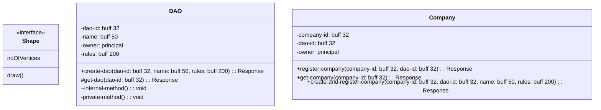

# Scenario 2: eDAO and Resource Contracts


Goal here is to include company concepts; resources, invoices etc within the eDAO structure.

1. resources are managed by resource manager
2. resource manager is managed by eDAO

````mermaid

````

### Class Diagram




\


<figure><figcaption></figcaption></figure>

### Flow Diagrams
