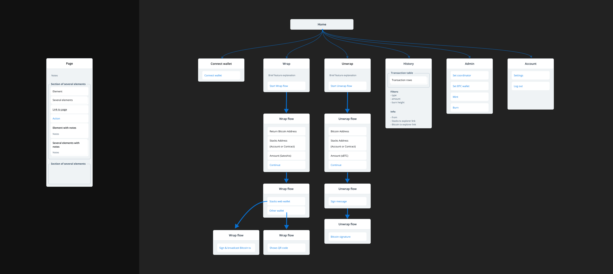

# UI/UX Design Plan

## Reference

Example designs (other bridge projects)

* [https://trustlessbridge.io/](https://trustlessbridge.io/)
* [https://core.app/bridge/](https://core.app/bridge/)
* [https://bridge.renproject.io/release](https://bridge.renproject.io/release)
* [https://dashboard.threshold.network/tBTC/mint](https://dashboard.threshold.network/tBTC/mint)

See also [transactions on mempool space](https://mempool.space/testnet/tx/64e6e415bbf81a351368249ee7b3f3e904f7130c302eac2b9368f7db96cda394) - for the amazing graphical representations.

## Milestones

1. UX Design - Figma mockups delivered, UX flows defined.
2. UI Design - design assets delivered

## User Flows

Question: do we need to support the op\_return mechanism at all?

1. Wrap BTC
   1. Using OP\_DROP
   2. Using oP\_RETURN
2. Unwrap BTC
3. User transaction history
4. General sBTC transaction history

### Personas

User 1: Anne - experienced bitcoiner

User 2: Ron - crypto curious

User 3: Lesley - newbie

## UX Assets

C/o Maxcim

<figure><figcaption></figcaption></figure>

<figure><figcaption></figcaption></figure>
